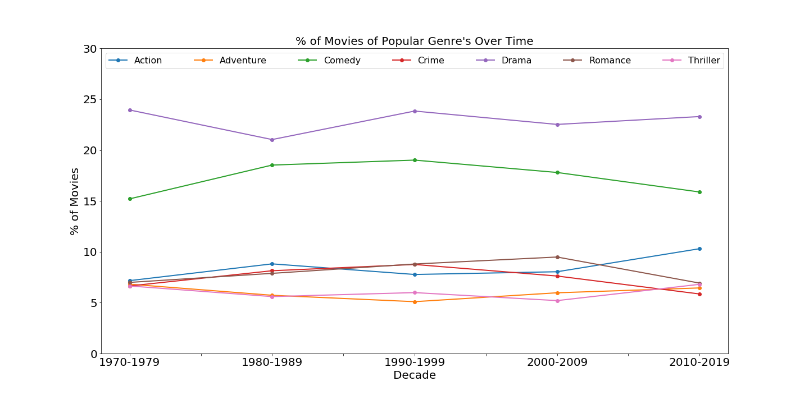
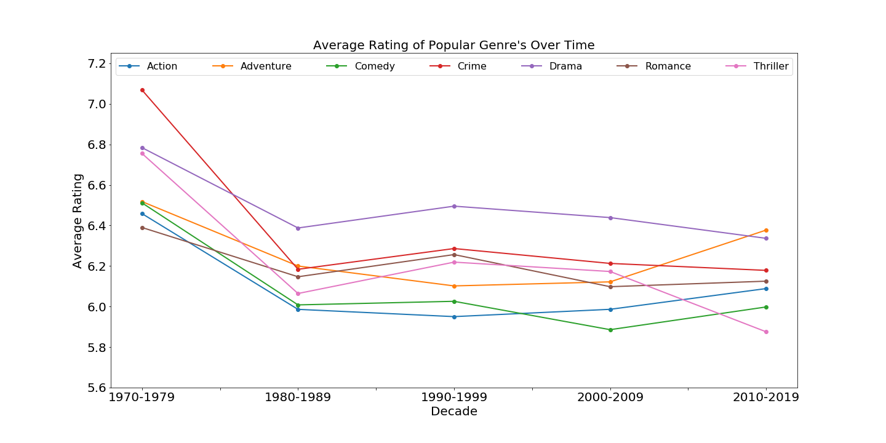
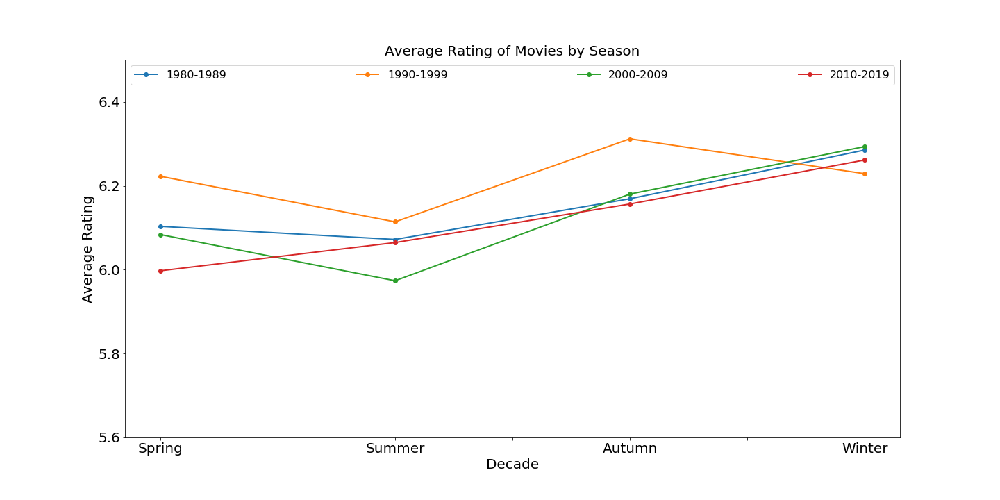
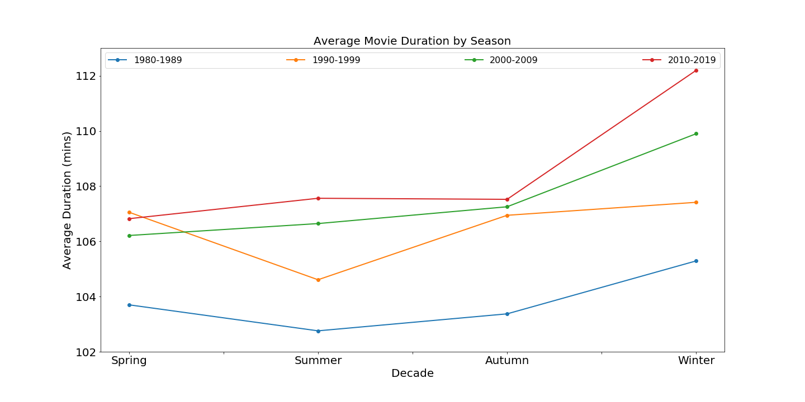
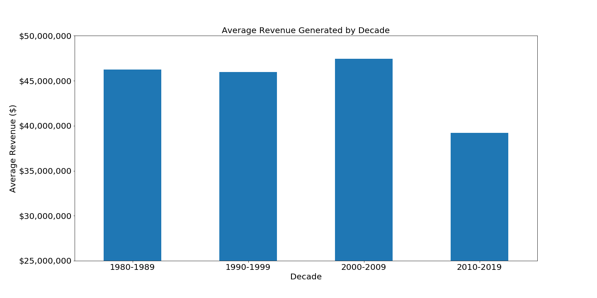
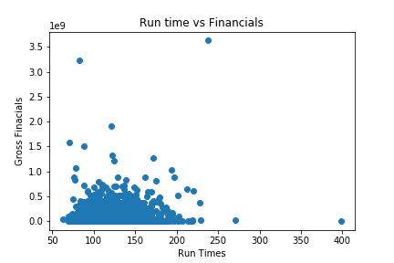

### Topic: Analysis of Movie Box Office Data Changes Over Time

**Team:**
* Nicole Cook
* Hermela Mekonnen
* Rob Savage
* Franklin Troung

**Tasks:**
* Pulling original data requests and merging data: Rob
* Cleaning data sets: Rob/Franklin
* Create DataFrame with cleaned data set & output to csv: Rob/Franklin
* Create visualizations of data and save as PNG files: Nicole, Hermela, Franklin
* Analyze cleaned data for any additional analysis: Team
* Create PowerPoint Presentation: Rob
* Presentation: Team

### Questions of Importance
* Do popular genres change over time?
* Does the audience’s taste for genre change over time?
* Do seasons have an effect on the metrics of a movie?
* Do seasons impact runtime and audience ratings?
* Has movie revenue (adjusted for inflation) fluctuated through the decades?
* Does duration  have any impact on the financial success of a movie?

### Data Sources
* IMDb movies extensive dataset: 
https://www.kaggle.com/stefanoleone992/imdb-extensive-dataset
* Box Office Mojo: https://data.world/eliasdabbas/boxofficemojo-alltime-domestic-data

### Other things to take into consideration
* Revenue will need to take into account inflation
* Since movies can belong to more than one genre, we will need to have a separate stacked data set for this comparison

# Data Analysis

## Popular Genres Over Time

* There is not a lot of variation in the top genre's released over time. Drama and Comedy have been the top two genres for the last 50 years. There is a little variation in the rest of the top 5, but they have included Action, Romance, Crime, Thriller and Adventure.

* Dramas make up about 23% of movies released each decade, while comedies make up about 17% of movies released each year.

* But the most popular genres don't necessarily translate into ratings. The highest rated movies of the last 50 years are biography, history and animation.

* Looking at the most popular genres over time, their overall ratings tend to be rather consistent, except for the 1970's where movies tended to be rated higher over all. 

## Impact of Seasonality on Average Revenue/Ratings/Duration

* Movies released in winter tend to be higher rated than any other season, while movies released in summer tend to be lower rated. Much of this may be attributed to the high profile action movies that are usually released during this time frame. While full of great CGI and visuals, storylines generally fall by the wayside.  

* Movies released in summer bring in the most revenue overall, while autumn tends to bring in the lowest revenue. Summer is generally viewed as the peak time to release highly anticipated movies since families have the most amount of free time during this section of the year. This may explain why the revenue figures are so high.

* Movies released in the winter have longer run times than those released any other time of year. 

## Average Revenue by Decade

* Using data from 1980-present, there wasn't much of any significant data to report on until the 2010's. Much of revenue which was adjusted for inflation remained close to in proximity until there was an abrupt 20% decline in revenue from 2010-2019. The general assumption is that the way in which the public ingested movies changed during that time period. Netflix launched their streaming service in 2007, but didn't really start to gain significant momentum until 2010.  

## Impact of Duration on Revenue

* There was an innate curiousity surrounding movie run time and the resulting revenue. With the attention span of today's audience dwindling due to instant gratification, there was an idea that the longer a movie ran, the less money it would make. There are a few blockbuster movies that come to mind that run over 3 hours long that have done well, but we were curious to see if there were any other outliers. 

* There were no significant correlations with movie run time and gross revenue. The bulk of movies stayed within the 2.5 hour threshold and performed similarly. Outside of a handful of outliers, nothing interesting.

## Conclusions: Things to Ponder

**Genres over Time**
* Not much variation in film genres over the last 50 years. Dramas and Comedies dominate that time frame with 40% of films over that period.

**Biographies**
* Biographies churned out the highest ratings, but weren’t players at the box office. 

**Golden Era**
* Movies have come a long way, but according to audience ratings the 70’s serve as the pinnacle of filmmaking.

**$$$ vs. Critical Acclaim**
* Summer blockbusters proved to be hits at the box office, but not in the hearts of critics.

**Sign of things to come?**
* The 2010’s saw a major hit in box office revenue. With at-home viewing becoming the new norm, how will this affect films moving forward?

**Duration vs. Revenue**
* No significant correlations were found between movie durations and the financial success of a film. 

